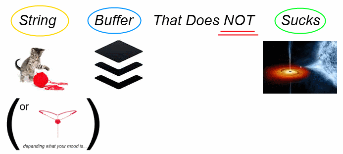

<h1></h1>

<ul>
<li><h3><strong>Significantly Faster</strong>: <em>Much</em> Better than using the <code>+</code> operand.</h3></li>
<li><h3><strong>Easy Multi-Line Append</strong>: Easy enter anything, no escaping needed, full Unicode support.</h3></li>
<li><h3><strong>Chain</strong> as much <code>.append</code> calls one to another, with minimal to none operation-cost.</h3></li>
<li><h3><strong>Simplified Usage</strong>: No <code>new</code> needed, also- save one <code>.append</code> by already starting with a value..</h3></li>
</ul>

<h3>Developer Notes</h3>
<ul>
<li><h4><strong>Memory Efficient</strong>: Relaying on native <code>Array</code> object, with <em>object-oriented</em> properties.</h4></li>
<li><h4>Multi-Line uses a multi-line comment, which is unrestricted by nature, wrapped with a function. The functions's content (its <code>.toString</code> (a prototype from <code>Function</code>) allows accessing the comment - and grabbing the content without the <code>/*</code> and <code>*/</code> wrapping - pretty awesome! <sup>right?</sup>, thank this repository for the idea: <a href="https://github.com/sindresorhus/multiline">github.com/sindresorhus/multiline</a> &nbsp; <strong><a href="https://github.com/sindresorhus/multiline/issues/35">I did!</a></strong>.</h4></li>
<li><h4>When calling the method the system does create a new object, and array (internally) which, due to shorthand does not required you to use the <code>new</code> syntax :]</h4></li>
</ul>

<hr/>
<h3>The Code. <sub>Just in-case you don't feel like opening <code>multiline_buffered.js</code> above..</sub></h3>

```js
function multiline_buffered(content){ "use strict";
  var  buffer                  = []
      ,REGEX_EXTRACT_MULTILINE = /^\s*function\s*(\s*)\s*{\s*\/\*(.*)\*\/\s*\}\s*$/im
      ;

  //private functions
  function append_string(content){    buffer.push(str);                                       }   //plain text
  function append_multiline(content){ content = content.toString().replace(/function/ig,"");      //multiline
                                      append_string(content);                                 }
  function append_buffer(content){    buffer = [].concat(buffer, content);                    }   //buffer

  //main usage (will be made public next)
  function append(content){
    if(     "string"   === typeof content)                            append_string(   content);
    else if("function" === typeof content)                            append_multiline(content);
    else if(  "object" === typeof content
            &&"array"  === content.constructor.name.toLowerCase())    append_buffer(   content);
    return buffer;
  }

  function toString(separator, is_return_buffer_too){
    var result;

    separator             = "undefined" === separator ? "" : separator; //optional (when not defined, normalised to empty string)
    is_return_buffer_too  = true === is_return_buffer_too;              //optional (when not defined, normalised to false)

    result = buffer.join(separator);

    if(true === is_return_buffer_too)   result.buffer = buffer;     //object-oriented, puts buffer as object's attribute.
    else                                buffer = undefined;         //cleanup (usually at the end of append chain when got string result).

    return result;
  }

  //public access to methods (and internal buffer)
  buffer.append   = append;  
  buffer.toString = toString;

  append(content);  //(optional) start with content: `multiline_buffered(..content..)`.  Same as `multiline_buffered().append(..content..)`.

  return buffer;
}
```

<hr/>

<h3>Usage <sub>By Examples</sub></h3>

non-sense (sanity) usage: <em>add string, get it back</em>.

```js
multiline_buffered("Hello World!").toString();
```

<pre>
1  |Hello World!
</pre>

<hr/>

multiline classic behavior. 

```js
multiline_buffered(function(){/*Hello
 World!*/).toString();
```

<pre>
1  |Hello
2  | World!
</pre>

<hr/>

chain strings together <sup>significantly <strong>faster</strong> than using the <em><code>+</code></em> operand</sup>.

```js
multiline_buffered().append("hello").append(" ").append("world!").toString();

//or

multiline_buffered("hello").append(" ").append("world!").toString(); //'save' one append by starting with some data
```

<pre>
1  |Hello World!
</pre>

<hr/>

chain strings to generate an easy wrap.
<sup><em>Example: an easy closure wrap to keeps your DOM clean.</em></sup>

```js
multiline_buffered()
.append("(function(window, document){")
.append(function(){
/*
  var me_so_happpppppy = ":)";

  console.log("hello");
  console.log("world!");
*/
})
.append("}(self, self.document));")
.toString();
```

<pre>
1  |(function(window, document){
2  |  var me_so_happpppppy = ":)";
3  |  console.log("hello ");
4  |  console.log("world!");
5  |}(self, self.document));
</pre>

<hr/>

<sub><a target="_blank" href="https://paypal.me/e1adkarak0" rel="nofollow"></a></sub>
